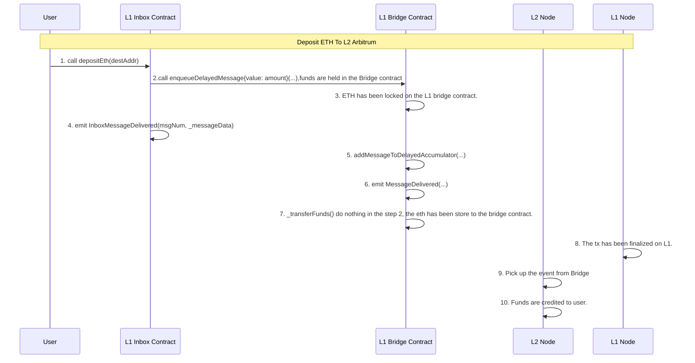

# Deposit ETH to L2 Arbitrum

```mermaid
sequenceDiagram
    participant User as User
    participant Inbox as L1 Inbox Contract
    participant Bridge as L1 Bridge Contract
    participant Node as L2 Node
    participant Node1 as L1 Node
    Note over User, Node1: Deposit ETH To L2 Arbitrum
    
    User ->> Inbox: 1. call depositEth(destAddr)
    Inbox ->> Bridge: 2.call enqueueDelayedMessage{value: amount}(...),funds are held in the Bridge contract
    Bridge ->> Bridge: 3. ETH has been locked on the L1 bridge contract.
    Inbox ->> Inbox: 4. emit InboxMessageDelivered(msgNum, _messageData)
    Bridge ->> Bridge: 5. addMessageToDelayedAccumulator(...)
    Bridge ->> Bridge: 6.  emit MessageDelivered(...)
    Bridge ->> Bridge: 7. _transferFunds() do nothing in the step 2, the eth has been store to the bridge contract.
    Node1 ->> Node1: 8. The tx has been finalized on L1.
    Node ->> Node: 9. Pick up the event from Bridge
    Node ->> Node: 10. Funds are credited to user.

```
