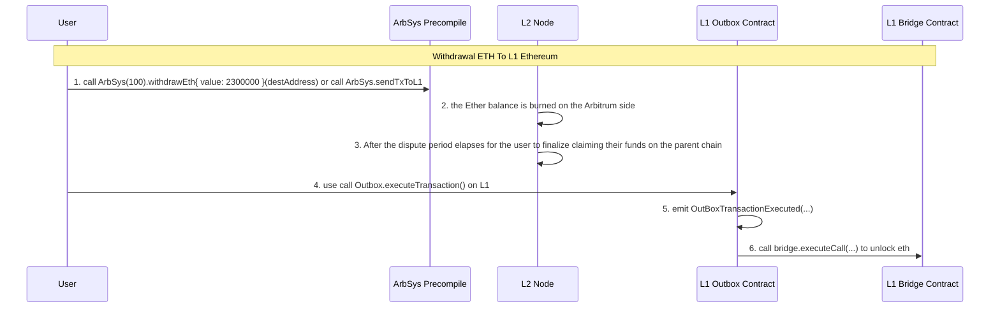

# Withdrawal ETH to L1 Ethereum

```mermaid
sequenceDiagram
    participant User as User
    participant ArbSys as ArbSys Precompile
    participant NodeL2 as L2 Node
    
    
    participant Outbox as L1 Outbox Contract
    participant Bridge as L1 Bridge Contract
    
    Note over User, Bridge: Withdrawal ETH To L1 Ethereum
    
    User ->> ArbSys: 1. call ArbSys(100).withdrawEth{ value: 2300000 }(destAddress) or call ArbSys.sendTxToL1
    NodeL2 ->> NodeL2: 2. the Ether balance is burned on the Arbitrum side
    NodeL2 ->> NodeL2: 3. After the dispute period elapses for the user to finalize claiming their funds on the parent chain
    User ->> Outbox: 4. use call Outbox.executeTransaction() on L1
    Outbox ->> Outbox: 5. emit OutBoxTransactionExecuted(...)
    Outbox ->> Bridge: 6. call bridge.executeCall(...) to unlock eth
```
